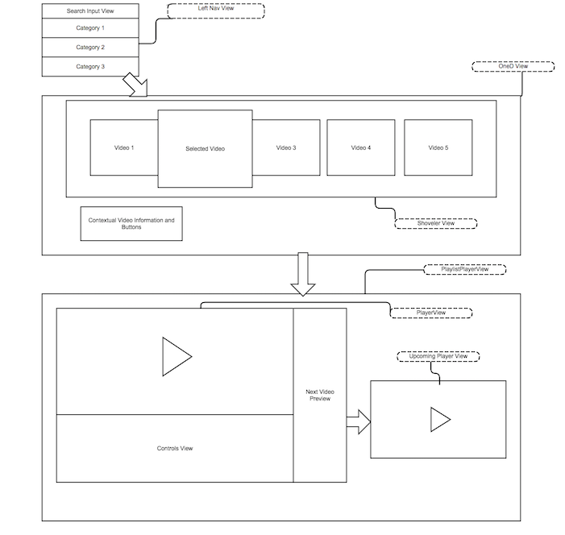

# Architecture Overview
-------------------
The Web App Starter Kit is an open source project meant to be a template for creating a wide variety of video applications for FireTV and FireTV Stick. It is designed so that common components can be mixed and matched, and customized to tailor the user experience as desired. We provide pre-made examples which can be used as is, or modified to support typical media app features. The Starter Kit is designed to cover many video content delivery application possibilities, and set up structure for easily reusing common code and allowing developers to expand on what we have created to suit their individual needs. 

Each component of this project can be overriden as long as the overridden code adheres to the basic API endpoints we have describe below. We use [gulp](http://gulpjs.com/) to create a project build structure, and provide several different project examples. Please refer to the [Building Document](./building.md) for more information on how the projects are structured.

The Starter Kit follows the MVC (Model View Controller) pattern to help with customization. The main components of applications built using the starter kit would typically include:

* an app.js which serves as the main controller for tying together the models and views. 
* an index.html with templates used for rendering individual views based on [Handlebars](http://handlebarsjs.com/).
* a variety of utility classes for helping handling common functionality such as button presses, date formatting, event handling, etc.
* views for rendering the different visible portions of the application, such as (but not limited to): category and video navigation, buttons, the video player, the video player onscreen controls, and purchase user interfaces.
* the model, which connects the application's data to the Starter Kit project, which could simply use one of our pre-existing models for data formats such as: JSON, MRSS, and the YouTube API. These are described below and in the [Platforms Document](./platforms.md)
* an init.js file which kick-starts the application and allows the developer to define application settings described below. The application settings are described in more detail below.

The project aims to be JavaScript framework agnostic and makes minimal use of libraries.  [jQuery](http://jquery.com/) is used primarily for CSS related class/style changes and DOM manipulation, [Handlebars](http://handlebarsjs.com/) is used to combine HTML templates and model data into DOM content. [SASS](http://sass-lang.org) is used to style the Starter Kit as a css extender. All of the JS modules are AMD(Asynchronous Module Definition) friendly but are loaded manually.

## User Interface Flow
-------------------

The user interface for the app is described as follows:

* The main page contains a list of categories on the top left and horizontally scrolling poster elements in the middle. The user can navigate the horizontal list with the *LEFT*/*RIGHT* and *SELECT*/*PLAY* to play a respective video. *UP* or *DOWN* will select the vertical category menu which can be opened with *SELECT*/*RIGHT* or deselected with *LEFT*/*BACK*.

* Video players are provided as part of the Starter Kit, with the simplest being a full screen HTML5-based video element, as well a YouTube player utilizing an embedded iframe. In all players, *BACK* exits and returns to the app (at the detail page), while other media controls vary depending on the feature set available from the embedded player. Continuous playback, which allows the user to watch videos back to back without interruption, is enabled for the sample projects, so if a user doesn't press *BACK* while in a video, and there are more videos available to play, it will show a preview of the next video before the video completes, and transition automatically into playing the next video when the video completes. If continuous playback is disabled, or there are no videos left to play in the dataset, the video will return to the main application view. 

* The Starter Kit also supports subcategories, for building nested hierarchy of categories. If a user selects a subcategory, the current OneD View(see image below) content fades out and a new OneD fades in. The left navigation menu is removed and replaced by the subcategory title. The user pressing the *BACK* button fades out the subcategory OneD view and fades in the previous OneD view. Subcategories can be many levels deep, and exiting a subcategory will  fade into the previous subcategory, until you reach the highest level which is the initial main view.  

## Navigation and Button Handling
-------------------
 
Navigation is primarily handled via button events, although there is some rudimentary touch support. The button event handling is provided by a buttons class.  The button set and best practices for behaviors are:

* *UP* scrolls the selection up in the vertical list
* *DOWN* scrolls the selection down in the vertical list
* *LEFT* scrolls the selection left in horizontal lists, it also transitions from the menu back to the current horizontal row
* *RIGHT* scrolls the selection right in horizontal lists, or selects an element in the vertical list
* *SELECT* is used to select the currently highlighted item
* *BACK* is used to go back to the previous selection, or if at the base level of the application it will return to the FireTV dashboard
* *PLAY_PAUSE* play the selected video, and control pause state during playback
* *REWIND* during playback will skip back 10 seconds
* *FAST_FORWARD* during playback will skip forward 10 seconds

*(Note: the HOME, MENU, and MICROPHONE buttons on the FireTV remote are not available to web applications. While the FireTV platform supports the analog game controller, this template does not yet work with the analog joysticks)*

## Code Organization
-------------------
controller:

* `src/common/html/index.html` : container for app, spinner, loads library scripts and app JS and kicks off app
* `src/common/js/app.js` : the app logic to put all the pieces together

scss: 

For more information on SCSS please refer to the [Styling Documentation](./styling.md)

model:

* `src/common/js/model-json.js` : our generic model which supports a JSON format specific to the Web App Starter Kit template
* `src/common/js/model-mrss.js` : a model which supports Media RSS feeds, for more information please refer to the [Platform Documentation](./platforms.md)
* `src/common/js/model-youtube-api.js` : a model which interacts with the YouTube API, for more information please read the [Platform Documentation](./platforms.md), an example can be viewed in the `src/projects/youtube/` directory.

views:

* `src/common/js/leftnav-view.js` : the vertical category menu from the app
* `src/common/js/one-d-view.js` : the horizontal poster area of the app
* `src/common/js/shoveler-view.js` : provides the horizontal scrolling list of posters for the 1D view
* `src/common/js/playlist-player-view.js` : a playlist player view, which acts as a player but load multiple videos with an intermediate screen
* `src/common/js/player-view.js` : shows the video with a full screen `<video>` tag
* `src/common/js/search-input-view.js` : the simple search widget for the left nav list
* `src/common/js/subcat-view.js` : the subcategory list view
* `src/common/js/controls-view.js` : the player controls view with timeline and description
* `src/common/js/controls-view-live.js` : the player controls view for live streamed videos
* `src/common/js/search-input-view.js` : the simple search input box view
* `src/common/js/player-view-youtube.js` : a player that uses the YouTube JS API to embed video and control playback

other:

* `src/common/js/util.js` : some helper functions for handlebars and CSS style sheet manipulation
* `src/common/js/events.js` : a very simple placeholder for event registry/dispatch
* `src/common/js/buttons.js` : provides a very simple event flow for buttons on remote
* `src/common/js/touches.js` : provides very simple and rudimentary touch support for tablets

assets:

* `src/common/images/img_logo.png` : the application logo (can be overwritten through JSON theming)

libraries:

* `src/libs/handlebars-v1.3.0.js` : [Handlebars](http://handlebarsjs.com/) is a minimal library for generating HTML from templates
* `src/libs/jQuery.js` : [jQuery](http://jquery.com/) version 2.1.1

### App Structure
-------------
** Class structure and Object Creation**

We have 4 Basic Object types in the application:

*`the app object` : The app object is defined on window.app, it is the instance of the application. This object is the glue that knows about the model, and all of the different views, and how views should transition between other views. The app object creates the views and binds listeners to the views events to handle transitioning from view to view. It also hides views when necessary and removes views which are no longer in use. The app init kicks off the initial view creation starting the entire app.

The app object accepts an object with settings parameters that are passed in from the `src/project/<project-name>/init.js`. This is how you customize your application, you can significantly flavor your app based on the settings object, for example you can switch out players, or add continuous playback support by using the PlaylistView setting. 

The settings object has the following available properties:

   - PlayerView {ViewObject} = this is the player view used for playing media, some examples are: PlayerView and YouTubePlayerView
   - PlaylistView {ViewObject} = if this is set the app will use a PlaylistView in conjunction with a PlayerView for use in continuous playback situations. One PlaylistView is provided by the WebAppStarterKit, which is the PlaylistPlayerView. If this is not set continuous playback will be disabled. 
   - entitlement {Boolean} - if true the Amazon In-App Purchase modules will be loaded. For more information on In-App Purchase refer to the inAppPurchase document.
   - previewTime {Number} - if using the PlaylistPlayerView you can set the preview time to tell the app how long the Preview Next Video View is shown before the current video completes. 
   - displayButtons {Boolean} = in the '1D' view (described below) there are optional buttons that appear under the content information. This is a flag to show/hide these buttons.
   - showSearch {Boolean} = enables Simple Search in the 1D menu, please note the model must implement the `getDataFromSearch` function for this to work correctly.

The settings object can also additionally have some options that are model specific such as the following for the generic JSON model:

- dataURL {String} = the URL for retrieving the application data.

EXAMPLE :
   
        var settings = {
            dataURL: "./assets/genericMediaData.json",
            displayButtons: true
        };
        var app = new App(settings);

For more information on model specific settings please refer to the [Platforms Documentation](./platforms.md)

* `the views` : There is several view objects, `left-nav`, `1D`, `video player`, in addition there is a sub view `shoveler-view`. Views are created and handled by the app object. All views are encapsulated so all communication from one view to the other is handled by the view triggering an event, and the app object handling that event and doing the corresponding action. However in the case of a subview like the `shoveler view`, this is instantiated by its parent view, which in the sample application is the `1D view`, and the events of the shoveler view are handled by the `1D` view since it is its parent. The app object can be considered the global parent to the views.

* `the model object` The model object is discussed in more detail above, but it is the source of truth for data in the application. Currently this loads all the data initially, but a developer could refactor this to load data on the fly through AJAX, or modify the model in any ways needed to convert their app specific API data into the format required by the template to function. Views and the application can access the model data if necessary through `app.data`

* `utility objects` We have several utility objects, such as `events`, `buttons`, `touches` and `utils`, events is for event handling, buttons is for button handling, and utils is different helper functions needed on a global level. More details of these are described throughout the document.

* `object creation`: throughout the application we use an object creation method to encapsulate all the objects and the parent which the object is attached to, this allows the code to be reusable in other projects, our standard object creation is in the code block below:

        (function(export) {
            "use strict;"
            var MyObject = function() {
                //object code here
            }

            export.MyObjects = MyObject
        )(parent));
    The code creates an [IFFE](https://en.wikipedia.org/wiki/Immediately-invoked_function_expression) to create an encapsulated scope, and sets up the object and attaches it to the passed in parent object, which could be window as we typically use but could be any object provided by the developer.

** Template structure and DOM Structure **

We use handlebars templates for our template system. All of our handlebars templates are provided in the project's `index.html` and clearly marked by comments.

We have a single handlebars helper function for determining the amount of content on the main content view, which is in `utils.js`. Each View object is responsible for pulling its own template, and populating it, and adding it to the DOM under the provided parent. This is handled in the view's render function, which takes the parent element to insert the DOM element into. The view will create a property on itself called $el which is a jQuery object referencing the views DOM element.

The user interface flow is based around preserving the state of views you will return to by hiding them, and dispensing of screens that have been closed by destroying them. For example 1D view transitions to the player view, the 1D view exists in the DOM but is hidden, and the player view is shown, however on transitioning backwards, the player view would be removed from the DOM and cleaned up. 

** Event structure **

We use a simple event handling system which is implemented in `events.js`. Each view can trigger 6 events:

* `exit` - triggered when the view is exited
* `startScroll` - triggered when scrolling has begun within the view(button held down)
* `indexChange` - triggered when an the selected element in the view has changed
* `stopScroll` - triggered with the scrolling has stopped within a view(button released)
* `select` - triggered when a view is selected as the current view
* `deselect` - triggered when a view is deselected as the current view
* `loadingComplete` - triggered when a view is finished loading
* `bounce` - triggered when a boundary is hit when navigating a view
* `makeActive` - triggered when an element is set as the active element
* `noContent` - triggered when a no content is returned for a given search or category
* `videoError` - triggered when there is a problem with loading or playing a video
* `searchQueryEntered` - triggered when the user enters a search query  
* `videoStatus` - triggered by the player view to update the video status

Events are triggered by calling a view's `trigger` method, passing the event name and optional arguments:

        // inside a view - triggers the startScroll event
        this.trigger('startScroll', -1);

Event handlers are registered by calling the view's `on` method, passing a callback.  Any additional arguments to 'trigger' are passed to the callback:

        // inside app - register for the startScroll event from the container view
        app.mainContentView.on('startScroll',
            function (direction) {
                //code here
            }, app);

Event handlers can be removed with the `off` function passing the same arguments as the `on` function with a reference to the callback to remove:

         // inside app - deregister for the startScroll event from the container view
        app.mainContentView.off('startScroll', myCallBack, app);

** Button Handling **

The Fire TV remote functions as a keyboard, and for the 5-way navigation buttons and media control buttons it will emit the usual keyDown and keyUp events.  The *BACK* button is captured by the browser and ***not*** sent as key event; our app needs it for navigation, so our buttons utility converts browser history events to *BACK* button presses.  

When the remote buttons are held down they generate repeated keyDown events with no easy way to distinguish a repeat from the original press, or to control the repeat interval.  Our buttons class converts these to single 'buttonpress' events followed optionally by one or more 'buttonrepeat' events at a decaying interval.

Key events can also overlap, that is you can press a 2nd button while another is held down, and tracking this properly adds complexity.  Our buttons class filters out any extra events, such that only the first button pressed will generate events until it is released.

The buttons class uses Events to trigger the button events.  The App is the only listener, and the app routes button events to the current view.

Some helper functions are needed for edge cases:

* `reset` - stop emitting events for the currently pressed button, used when the app changes views and doesn't want repeat or release events from the previous screen to be sent to the next
* `resync` - clears all key tracking state, needed when the the web app loses focus because keyUp events may never be sent

** Use of jQuery and Handlebars **

Throughout the template we use only two third party libraries.

** Handlebars **

Handlebars is used by creating a template in the initial DOM tree in a script tag marked as handlebars like so:

        

The view then takes that template and populates it with a JSON object to create the DOM element dynamically to be displayed on the page, this is done in the view's `render` method. We have a utility method called `buildTemplate` which comes from the `utils.js` file. Here is an example:

        var html = utils.buildTemplate(
        $("#left-nav-template-template"),
            {
                rows: rowData
            });

            el.append(html);

This is the extent of Handlebars use, it could most likely be easily replaced by another template system the developer prefers.

** jQuery **

jQuery is the other third party library we use throughout the project. This library is used in a number of different ways, usually for the helper methods it provides. Most of the use cases we use it fore are:

 * adding and removing classes from elements
 * searching for elements
 * adding css to multiple elements at the same time without a separate loop.
 * some helper functions for retrieving element data like computed width
 * loading the initial JSON through its ajax handler
 * hiding/showing elements, toggling elements, and other quick helper functions to make the code more readable.

While we use jQuery, we try to stick to straight JavaScript when there is not a huge tangible benefit to jQuery, this should allow developers to theoretically replace the jQuery parts with their own JavaScript or a library of their choice.

### About the Model
---------------
** The application model**:

The JSON gets loaded by the application at the time of document load, and converted into a Model Object with the following functions:

* `loadInitialData` - This function loads the initial data needed to start the app and calls the provided callback with the data when it is fully loaded.
* `setCurrentCategory` - how the view sets the currently selected category, from the left nav
* `getCategoryData` - gets the currently selected category data for loading into the horizontal 1D/Shoveler view. This function uses a callback to return the data so the data can potentially be loaded through an asynchronous request, although our template model provided does not load it asychronously. 
* `setCurrentSubCategory` - how the application sets in the model the current subcategory that was selected so the model can fetch the correct subcategory contents to be displayed.
* `getCurrentSubCategory` - the function which returns a subcategory object with `type: "subcategory"` and a `contents` property containing an array of the media objects similar to what is returned by `getCategoryData`, data is returned through a callback so it can be loaded asynchronously.
* `getDataFromSearch` - gets the data from search results for the current search term for loading into the horizontal 1D/Shoveler view. This function uses a callback to return the data so the data can potentially be loaded through an asynchronous request, although our template model provided does not load it asynchronously. This is necessary to be implemented for the search functionality in the left nav menu. See information on the settings object to remove this functionality. 
* `setCurrentItem` - how you set the currently selected media element, from the 1D view
* `getCurrentItem` - gets the currently selected media element as an object with its meta data, for display on the 1D view

The instance of the model is stored under the application  instance after the app init is called, it can be referenced by **app.data**

Our application and model is designed that any of these functions listed can be overwritten to transform their specific application API into a model specially created for their application. The idea behind the template is that the model can be replaced with a model created by any app developer, and as long as that model contains the same functions, and the output data results in the same format as the above listed JSON object format, then the template will function normally. In short the application expects that these functins will be implemented, but does not assume anything about how they are implemented except that they return results in the correct format. The objective is to allow the template to be used with any datasource required by the a developer.

For example, our template currently loads all the of data in a single JSON request at the beginning, and the model functions are always working off of that data set. But if an application developer wanted to only load the categories for the menu on first load, and then do subsequent AJAX requests to retrieve data for each selected category, they should easily be able to write a model.js which contains a different `loadInitialData` and `getCategoryData` that does an AJAX request every time and uses the provided callback function.

**Examples of the changing the core model functions to fit your API** 

Example of changing the loadInitialData function:

         /**
         * @function loadInitialData
         * @param {function} the callback function to call with the loaded data
         * @description This function loads the initial data needed to start the app and calls the provided callback with the data when it is fully loaded
         */
        this.loadInitialData = function (dataLoadedCallback) {
                  //initial data expects this.categoryData to be filled with an array of category names. 
                  this.categoryData = ["Category1", "Category2", "Category3"];
                  //once the data is populated let the app know by calling the passed in callback function.         
                 dataLoadedCallback();
                    
        };

Example of changing the getCategoryData function to load data asynchronously with jQuery getJSON:

        /**
         * Get and return list of media data objects for a selected category 
         * @param {Function} categoryCallback method to call with returned requested data
         */
        this.getCategoryData = function (categoryCallback) {
            $.getJSON("http://myurl/categoryAPI/Category1", function(data) {
                var convertedData = {};
                //convert your API to our data format
                convertedData.id = data.uid;
                convertedData.title = data.name;
                convertedData.pubDate = data.date;
                convertedData.releaseYear = data.year;
                convertedData.imgURL = data.image;
                convertedData.description = data.description;
                //call our callback with the loaded converted data
                categoryCallback(convertedData);
            });
         };

** JSON Format: **

The model currently takes a specific JSON format which translates to filling out the data in the application.  The JSON consists of a single object containing a logo, a theme object, and a media object which contains an array of media records.  The categories end up separating content through the left navigation menu.

The JSON Object Format is as follows:
 
    {
        "folders": [
            { // the first folder is the root folder which translates to the top level folder which contains the contents of the left nav
                "id": "folder_id1",   
                "title": "root",
                "contents": [
                    {
                        type: "folder",
                        id: "folder_id2",
                    },
                    {
                        type: "folder",
                        id: "folder_id3",
                    },
                ]
            },
            {
                "id": "folder_id2",   
                "title": "Category 1",
                "imgURL": "http://your-image",
                "pubDate": "Mon, 21 Apr 2014 04:55:06 GMT",
                "description": "Category description"
                "contents": [
                    {
                        type: "media",
                        id: "id_1",
                    }
                ]
            },
            {
                "id": "folder_id3",   
                "title": "Category 2",
                "imgURL": "http://your-image",
                "pubDate": "Mon, 21 Apr 2014 04:55:06 GMT",
                "description": "Category description"
                "contents": [
                    {
                        type: "media",
                        id: "id_1",
                    },
                    {
                        type: "folder",
                        id: "folder_id3",
                    }
                ]
            },
            {
                "id": "folder_id3",   
                "title": "SubCategory",
                "imgURL": "http://your-image",
                "pubDate": "Mon, 21 Apr 2014 04:55:06 GMT",
                "description": "Category descriptions"
                "contents": [
                    {
                        type: "media",
                        id: "id_1",
                    },
                ]
            }

        ], 
        "media": [
                {
                    "id": "id_1",
                    "title": "Your title here",
                    "pubDate": "Mon, 21 Apr 2014 04:55:06 GMT",
                    "releaseYear": "2014",
                    "imgURL": "http://your_umage_url.jpg",
                    "videoURL": "http://your_video_url.mp4",
                    "rated": "PG-13",
                    "rank": "4"
                    "rating": "4.5",
                    "description": "Your summary or description here",
                    "categories": [
                        "Main Category 1",
                        "Main Category 2",
                        "Main Category 3",
                    ] 
                },
                "id_2" : ...,
                "id_3" : ...,
            ]
        }
    }   
    
** Folder Media Metadata **

The data for laying out the application structure. The first element of the folders array is the root folder, this corresponds to the left navigation menu of the application. The contents of this folder refer to the categories shown in the left navigation menu, **NOTE** these can only be folders and not media items at this time. The proceeding folder objects can have mixed contents of media and other folders, folders that parented by another folder will become a subcategory of that folder in the application. Folders aside from the root folder should have an `imgURL` for the thumbnail, and a `title`, `description`, and `pubDate` for correct viewing in the application. 

**JSON Media Metadata:**

The data which fills out the application is an object located in the Media key of the JSON file, as shown above.
  
Some of the metadata is specific to our sample application, and some would be more universally used in applications using the template. Using the code block above as a reference the context for meta data, we have split the meta data between universal and sample app specific:

** Universal media metadata: **

* `id` : the unique id of the media element
* `type` : the type of media element, currently has two types `video` and `video-live`
* `categories` : the main categories this element will be shown under(more information discussed below)
* `title` : the title to be displayed of the media element, i.e. video name
* `pubDate` : the full date that the media element was published, to be displayed on the detail view
* `imgURL` : the Medium sized img URL for display on the 1D row and detail view ** Currently the imgURL and thumbURL should be the same image, just scaled differently for load/performance reasons. The image URL should have a height of 546 with any aspect ratio. ** 
* `thumbURL` : the smaller image URL for display on the main content view ** Currently the imgURL and thumbURL should be the same image, just scaled differently for load/performance reasons. The thumbnail URL should have a height of 320 with any aspect ratio. **
* `bgURL` : the large 1080p image to be displayed as the background of the detail view
* `description` : the summary/description to be displayed on the 1D view and the detail view
* `videoURL` : the html5 capable video to be used when playing the media element
* `startTime` : *Live Streams Only* the start time in a valid JavaScript date string for the Date() constructor ([more info here](https://developer.mozilla.org/en-US/docs/Web/JavaScript/Reference/Global_Objects/Date)) of when a live broadcast will begin
* `endTime` : *Live Streams Only* the end time in a valid JavaScript date string for the Date() constructor ([more info here](https://developer.mozilla.org/en-US/docs/Web/JavaScript/Reference/Global_Objects/Date)) of when a live broadcast will end
* `alwaysLive` : *Live Streams Only* boolean to tell the app a stream is live 24/7 or not

** Sample app specific media metadata: **

The rest of the metadata in the element object is used for the sample data, such as director, stars, rated, rating, rank. Any meta data can be added by the developer and used to their liking to display in different parts of the app. The data can be added to the individual media objects and it will be passed when queried from the model as part of the return object.

** Live Streams **

The template has some basic support for live streams. If a media element is set to have a type of `video-live`, then it must contain a videoURL which references a HLS stream URL. A live video element must also either contain a true `alwaysLive` flag, if the stream is live 24/7, or a `startTime` and `endTime` date/time, of when the stream will begin and end. These properties drive the user interface for displaying and launching live streams

** Categories **

**Note** the `categories` in the media data will only be used if no `folders` object is in the JSON. If there is a `folders` object present it will take precedence in creating the category and subcategory structure of the application.

Categories are displayed in the left navigation menu. The app will automatically create a row in the left navigation menu for every unique category in the JSON data. From the above example there will be 3  left navigation rows.

 * "Main Category 1"
 * "Main Category 2"
 * "Main Category 3"

** Performance Considerations **

This project intends to demonstrate best practices for creating a fluid user experience with HTML.  We have found several issues along the way where effort was required to achieve good performance, summarized below:

* For the scrolling views, we use the CSS translate3d transform and transitions to animate movement and elements. Particularly on the 1D view and Main Content view, we position each element individually and only move the elements on the screen.  This allows Chromium to put each item in its own render layer, moves most of the work of compositing to the GPU.  We keep the other elements off screen to the sides of the scroll direction in a "stack" to be retrieved. This has considerably helped performance, and Chromium DevTools "show composited layer borders" feature was very helpful in optimizing this structure.
* We use inline style changes through JavaScript many times instead of changing classes to select style sheets, this is to minimize the amount of "relayout" events on the page, which has helped much with performance in many situations. When performance is not an issue the app does modify class names to keep most of the styling in the style sheet.
* The app makes frequent use of setTimeout to make a style change after something has finished animating, so we are not combining operations.
*  In the 1D view, detail text elements aren't updated during continuous scroll to minimize layout and paint work and increase scroll frame rate.
* We use absolute positioning in many cases over relative positioning to minimize recalculations when an element moves or is changed.
* Native image sizes for the thumbnails and the 1D view can increase performance, this should be kept in mind if it is possible for the developer to do so.
* We use `translateZ` over z-index as it offloads the z-index and layering work to the GPU and performs much faster. Please note for this to work your outer container must have the `transform-style: preserve-3d` attribute set.
* We have cases where we reduce the allowed scroll speed to let animations finish so that the browser doesn't get over loaded and helps fluidity at the cost of scroll speed.

Please feel free to ask our team if you have any questions about fluidity or performance, or any suggestions!

